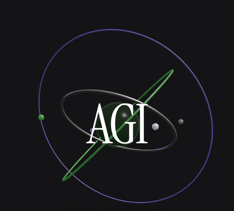
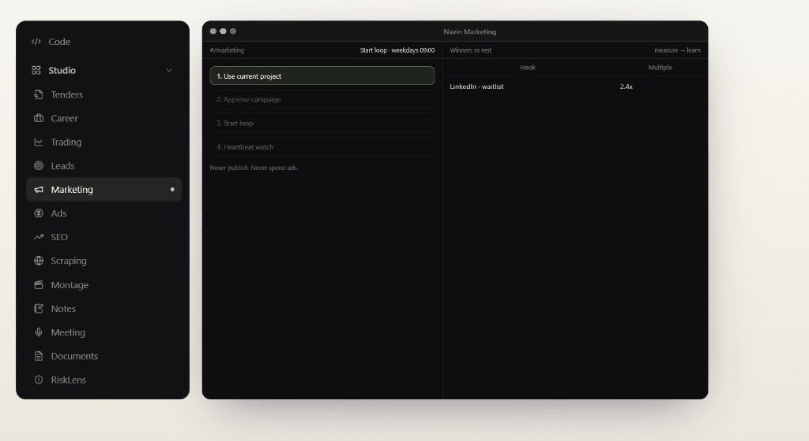
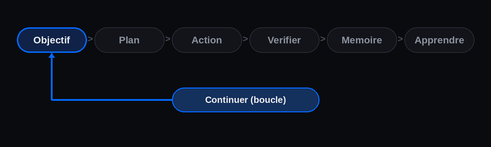
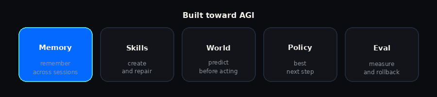
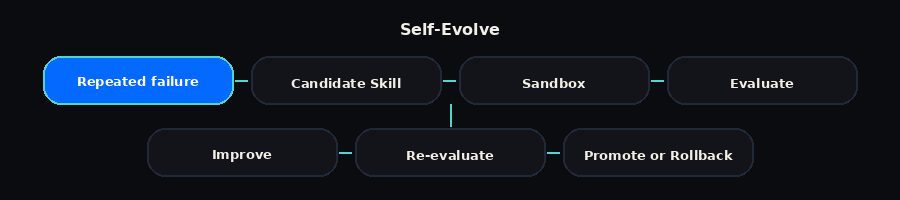
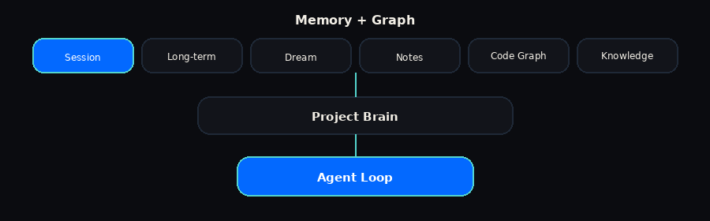
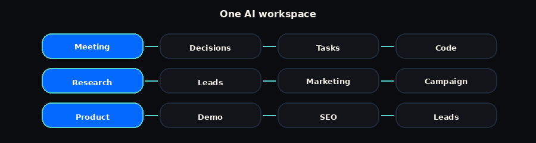
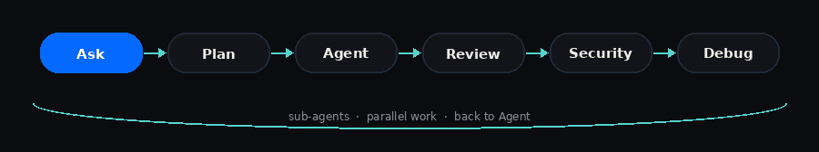
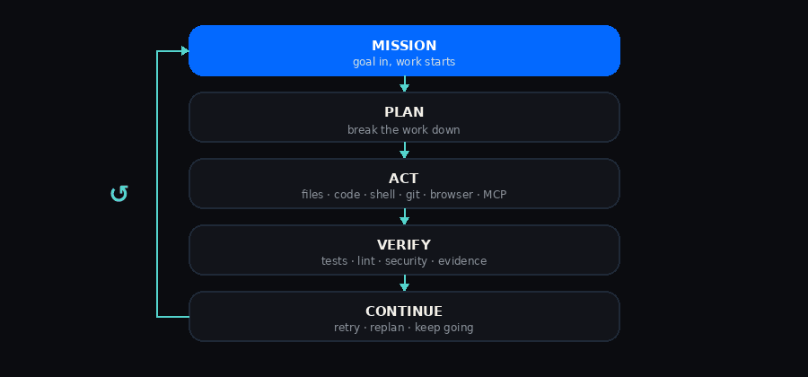
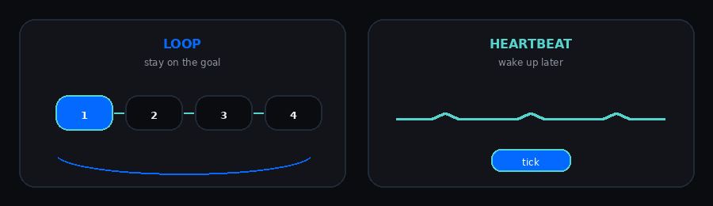

<div align="center">

<h2 align="center">
  
  <strong>NAVIN</strong>
  &nbsp;&nbsp;
  <strong>100% gratuit, open source, </strong>
</h2>

<p align="center">
  
</p>

[English](./README.md) - [Français](./README.fr.md)

[](./LICENSE)
[](./COMMERCIAL_LICENSE.md)
[](https://github.com/Navinspire-ia/navin)

Navin combine **Persistent Memory**, **Auto-Skills**, **Self-Evolve**, **World Models**, **Policy Learning**, les systèmes **Multi-Agent**, les **Loops** et **Heartbeat** pour aller au-delà des assistants statiques, vers des agents qui s'améliorent avec l'expérience.

Code - Research - Scrape - Automate - Create - Market - Learn - Evolve

Votre machine. Vos modèles. Votre agent.

<br>

[Télécharger Navin](https://navin.live/download) - [Documentation](https://navin.live/fr/docs) - [Contribuer](./CONTRIBUTING.md)

<br>

⭐ Star Navin si vous voulez des agents IA que vous possédez vraiment.

</div>

<p align="center">
  
</p>

## Pourquoi Navin ?

La plupart des outils IA s'arrêtent après une réponse.

Navin prend un objectif et continue de travailler.

<p align="center">
  
</p>

Navin tourne en application desktop et en CLI, fonctionne en local, accepte vos propres clés API et peut utiliser des centaines de modèles texte et multimodaux.

## Conçu vers l'AGI

Navin va au-delà des assistants statiques : des agents qui apprennent de l'expérience.

<p align="center">
  
</p>

<table>
  <thead>
    <tr>
      <th align="left" width="220">Capacité</th>
      <th align="left">Ce que ça fait</th>
    </tr>
  </thead>
  <tbody>
    <tr>
      <td></td>
      <td>Retenir l'expérience utile entre sessions, projets, code, notes et actions</td>
    </tr>
    <tr>
      <td></td>
      <td>Créer, tester, réparer et améliorer des Skills réutilisables</td>
    </tr>
    <tr>
      <td></td>
      <td>Anticiper ce qui risque d'arriver avant d'agir</td>
    </tr>
    <tr>
      <td></td>
      <td>Apprendre quelle action ou quel outil est le meilleur prochain pas</td>
    </tr>
    <tr>
      <td></td>
      <td>Chaque amélioration doit être mesurable, testable et réversible</td>
    </tr>
  </tbody>
</table>

Le but n'est pas seulement un agent qui marche. C'est un agent qui devient meilleur à travailler.

Navin ne prétend pas être l'AGI aujourd'hui. Le projet construit les capacités nécessaires pour aller vers une intelligence autonome de plus en plus générale.

## Self-Evolve

Quand Navin échoue plusieurs fois de la même façon, il peut transformer ça en une meilleure Skill réutilisable.

<p align="center">
  
</p>

La règle est simple : mieux qu'avant. Rien d'important ne se dégrade.

## Memory + Graph

Navin n'a pas à repartir de zéro à chaque session.

<p align="center">
  
</p>

## Un seul workspace IA

Navin relie beaucoup de workflows au même agent, à la même mémoire et au même contexte projet.

<p align="center">
  
</p>

<table>
  <thead>
    <tr>
      <th align="left" width="140">Module</th>
      <th align="left">Ce que Navin peut faire</th>
    </tr>
  </thead>
  <tbody>
    <tr><td></td><td>Build, Debug, Review, Security, Git, Terminal</td></tr>
    <tr><td></td><td>Recherche web, recherche multi-agents, documents</td></tr>
    <tr><td></td><td>Crawl, extraction, structure, analyse</td></tr>
    <tr><td></td><td>Trouver, enrichir, scorer, qualifier</td></tr>
    <tr><td></td><td>Recherche, stratégie, contenu, campagnes</td></tr>
    <tr><td></td><td>Trouver des opportunités, analyser, préparer les réponses</td></tr>
    <tr><td></td><td>Trouver jobs et missions freelance, analyser les opportunités</td></tr>
    <tr><td></td><td>Enregistrer, transcrire, résumer, extraire les actions</td></tr>
    <tr><td></td><td>Écrire, chercher, demander, relier la connaissance</td></tr>
    <tr><td></td><td>Tâches, décisions, contexte, exécution agent</td></tr>
    <tr><td></td><td>Audit, mots-clés, contenu, actions</td></tr>
    <tr><td></td><td>Image, vidéo, musique, voix, STT, TTS</td></tr>
  </tbody>
</table>

Un contexte. Une mémoire. Un système d'agents.

## Installation

### CLI

```bash
curl https://navin.live/install -fsS | bash
cd your-project
navin-cli
```

Windows PowerShell :

```powershell
irm 'https://navin.live/install?win32=true' | iex
```

`navin-cli` est l'agent terminal. `navin .` ouvre le desktop sur le dossier courant.

Après le lancement, ouvrez **Settings** pour ajouter vos clés et choisir un modèle. Dans `navin-cli`, appuyez sur **Ctrl+G**. C'est l'interface qui configure tout. Pas besoin d'éditer du JSON à la main.

### Desktop

Téléchargez depuis [navin.live/download](https://navin.live/download).

<table>
  <thead>
    <tr>
      <th align="left" width="240">Plateforme</th>
      <th align="left">Téléchargement</th>
    </tr>
  </thead>
  <tbody>
    <tr>
      <td>
        
      </td>
      <td>
        <a href="https://navin.live/download"><code>Navin-Desktop-macos-arm64.dmg</code></a>
      </td>
    </tr>
    <tr>
      <td>
        
      </td>
      <td>
        <a href="https://navin.live/download"><code>Navin-Desktop-macos-x64.dmg</code></a>
      </td>
    </tr>
    <tr>
      <td>
        
      </td>
      <td>
        <a href="https://navin.live/download"><code>Navin-Desktop-windows-x64-setup.exe</code></a>
        &nbsp;
        <a href="https://navin.live/download"><code>.msi</code></a>
      </td>
    </tr>
    <tr>
      <td>
        
      </td>
      <td>
        <a href="https://navin.live/download"><code>.AppImage</code></a>
        &nbsp;
        <a href="https://navin.live/download"><code>.deb</code></a>
        &nbsp;
        <a href="https://navin.live/download"><code>.rpm</code></a>
        &nbsp;
        <a href="https://navin.live/download"><code>.pkg.tar.zst</code></a>
      </td>
    </tr>
  </tbody>
</table>

### Depuis les sources

```bash
git clone https://github.com/Navinspire-ia/navin.git
cd navin
make install
make start
```

`make install` installe tout (dependances systeme si besoin, backend, WebUI). `make start` est le **dev** : Vite sur [http://localhost:5173/](http://localhost:5173/) plus le gateway.

```bash
make build
make start-prod
```

`make build` ecrit la WebUI prod dans `navin/web/dist`. `make start-prod` (ou `make start backend`) sert ce build via le gateway, en general [http://localhost:8765/](http://localhost:8765/).

```bash
make stop
```

Pareil avec les scripts : `sh scripts/install.sh` puis `sh scripts/start.sh`. En une fois : `sh scripts/start.sh --install`.

`make start front` = Vite seule. `make build front` / `make build backend` pour un seul cote. Relancer : `make restart`.

Depuis le depot : `.venv/bin/navin-cli` (Windows : `.venv\Scripts\navin-cli`).

Details : [Installation](./docs/Installation.md).

## Agents

Navin change de mode selon le travail. Il peut aussi créer des sous-agents pour un travail parallèle et spécialisé.

<p align="center">
  
</p>

<table>
  <thead>
    <tr>
      <th align="left" width="160">Mode</th>
      <th align="left">Rôle</th>
    </tr>
  </thead>
  <tbody>
    <tr>
      <td></td>
      <td>Comprendre sans modifier le projet</td>
    </tr>
    <tr>
      <td></td>
      <td>Créer un plan d'exécution</td>
    </tr>
    <tr>
      <td></td>
      <td>Construire, éditer, lancer, tester et itérer</td>
    </tr>
    <tr>
      <td></td>
      <td>Relire le code et proposer des correctifs</td>
    </tr>
    <tr>
      <td></td>
      <td>Analyser et durcir l'application</td>
    </tr>
    <tr>
      <td></td>
      <td>Reproduire, diagnostiquer, corriger et vérifier</td>
    </tr>
  </tbody>
</table>

## Agent Loop

Navin ne génère pas du code pour s'arrêter.

Il peut utiliser votre dépôt, le terminal, le navigateur, les fichiers, les outils et la mémoire jusqu'à ce que le travail soit fait, ou vraiment bloqué.

<p align="center">
  
</p>

## Loop + Heartbeat

**Loop** garde un agent sur un objectif pendant plusieurs cycles.

**Heartbeat** réveille des tâches autonomes et les fait continuer plus tard.

<p align="center">
  
</p>

Utile pour le code, la recherche, le monitoring, le scraping, les appels d'offres, les leads, la recherche d'emploi et les tâches longues.

L'autonomie reste bornée par les permissions, les budgets, les checkpoints et les kill switches.

## Modèles

Utilisez les modèles que vous voulez. Ajoutez vos clés et choisissez un modèle dans **Settings**.

**Local :** Ollama - LM Studio - vLLM - serveurs compatibles OpenAI

**BYOK :** vos propres clés API, 28+ providers et 380+ modèles texte et multimodaux, dont OpenAI, Anthropic, Google, xAI, Qwen, Z.ai / GLM, Kimi, MiniMax, DeepSeek, Mistral, NVIDIA et d'autres.

Workflows multimodaux : Image - Vidéo - Musique - Vision - Voix - STT - TTS

## Outils et intégrations

Fichiers - Code - Shell - Git - Navigateur - APIs - Bases - MCP - Plugins - SaaS

Étendez Navin avec des Skills, serveurs MCP, plugins, outils custom, agent packs, workflows et intégrations.

Canaux : WhatsApp - Telegram - Slack - Discord - Email - Teams et d'autres.

## Local-first

**Votre machine. Vos modèles. Vos données.**

Modèles locaux. Vos clés API. Modèles managés seulement si vous les voulez.

Pas de cloud obligatoire. Pas de provider obligatoire.

## Sécurité

Sandbox - Checkpoints - Permissions - Validations humaines - Isolation - Limites de ressources - Rollback - Kill switches

Plus d'autonomie ne veut pas dire plus de permissions.

## Documentation

[navin.live/fr/docs](https://navin.live/fr/docs) - [Installation](./docs/Installation.md) - [Capabilities](./docs/capabilities.md)

## Contribuer

Navin est open source. Les contributions sont les bienvenues : runtime agent, CLI, Skills, MCP, providers, mémoire, world models, policy learning, évaluations, intégrations, UI, documentation et correctifs.

Lisez [CONTRIBUTING.md](./CONTRIBUTING.md) avant d'ouvrir une pull request.

## Contributeurs

Construit par [Navinspire IA](https://navinspire.ai) et la communauté Navin.

[@aymenghad](https://github.com/aymenghad) -
[@anisf](https://github.com/anisf) -
[@Amira-ben-henda-eiagen](https://github.com/Amira-ben-henda-eiagen) -
[@hasseniImen](https://github.com/hasseniImen) -
[@maryem955](https://github.com/maryem955) -
[@medkhalilklai](https://github.com/medkhalilklai) -
[@SkanderBS2024](https://github.com/SkanderBS2024) -
[@yosra-wanen](https://github.com/yosra-wanen) -
[@nabilmersni2](https://github.com/nabilmersni2)

## Licence

Navin est sous double licence.

- Open source : [GNU Affero General Public License v3.0 (AGPL-3.0)](./LICENSE).
- Commerciale : une licence commerciale est proposée par Navinspire IA aux organisations qui souhaitent intégrer, modifier, redistribuer, embarquer ou commercialiser Navin sans les obligations de l'AGPL-3.0. Contact : [contact@navinspire.com](mailto:contact@navinspire.com).

Voir [LICENSE](./LICENSE) et [COMMERCIAL_LICENSE.md](./COMMERCIAL_LICENSE.md). Les contributions sont acceptées sous le [Contributor License Agreement](./CLA.md).

Copyright © 2026-present Navinspire IA.

<div align="center">

100% gratuit. Open source. Autonome. Conçu vers l'AGI.

Plan - Act - Verify - Remember - Learn - Evolve

[Télécharger Navin](https://navin.live/download) - [Documentation](https://navin.live/fr/docs) - [Contribuer](./CONTRIBUTING.md)

<br>

⭐ Star Navin si vous voulez des agents open source qui apprennent vraiment.

<br>

Votre machine. Vos modèles. Votre agent.

Fait par [Navinspire IA](https://navinspire.ai) - Paris

</div>
