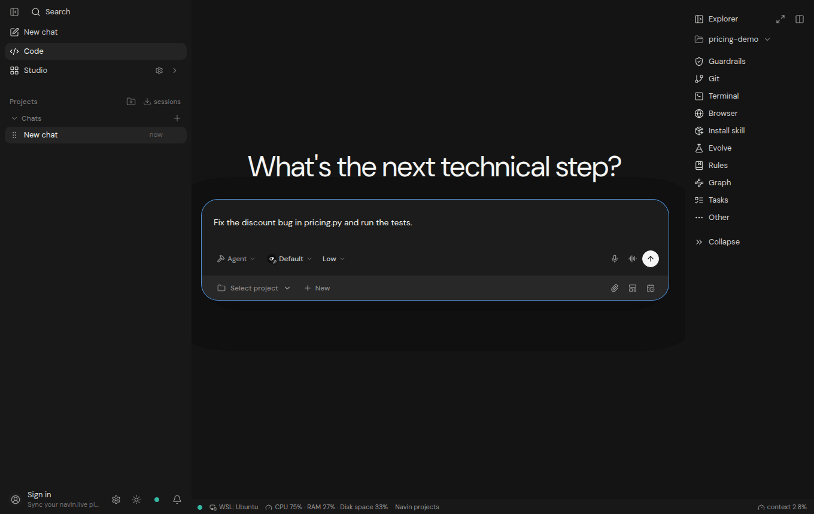
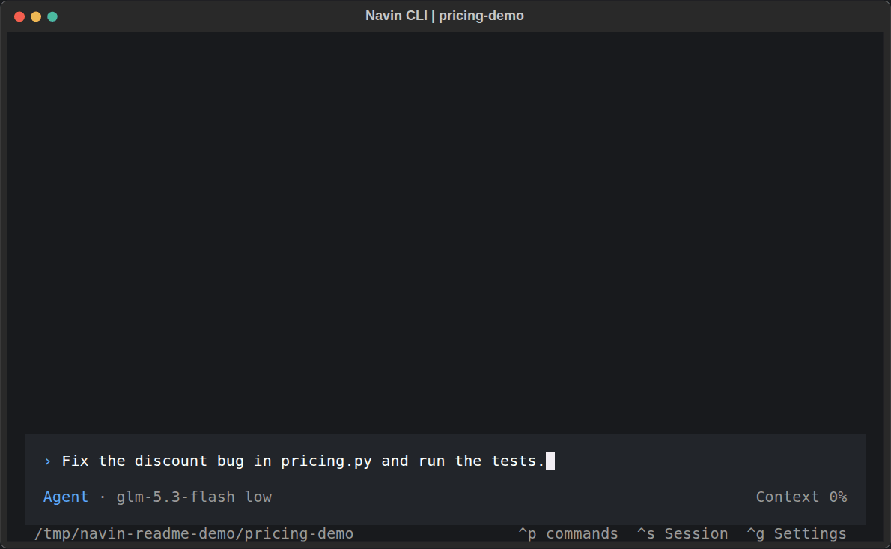

<div align="center">


# 目標を、完了した仕事に変える。

**コードを書き、調査し、ツールを使い、セッションを越えてコンテキストを引き継ぐ、オープンソースの AI エージェントワークスペース。**

<p>
  <a href="./docs/readme-demo.md"></a>
  <br>
  <sub>実際の Navin Desktop セッションを短縮した録画：確認 → 修正 → 6 件のテストに成功。 <a href="./docs/readme-demo.md">静止画と詳細</a></sub>
</p>

ターミナル、ブラウザー、デスクトップアプリで実行。モデルは自分で選び、コントロールは自分の手に。

[English](./README.md) · [Français](./README.fr.md) · [العربية](./README.ar.md) · [Español](./README.es.md) · [Português](./README.pt-BR.md) · [Deutsch](./README.de.md) · [简体中文](./README.zh-CN.md) · [日本語](./README.ja.md) · [한국어](./README.ko.md) · [Svenska](./README.sv.md)

[](./LICENSE) [](./docs/configuration.md) [](https://github.com/Navinspire-ia/navin/stargazers)

**[はじめる](#はじめる)** · **[デスクトップ版をダウンロード](https://navin.live/download)** · **[ドキュメント](./docs/README.md)** · **[開発に参加](./CONTRIBUTING.md)**

</div>

## Navin に仕事を任せる

> 「このバグの原因を見つけて修正し、関連するテストを実行して、変更内容を説明して。」

> 「これらの競合を調査し、出典を示しながらサービスを比較して、レポートにまとめて。」

> 「このプロジェクトを見守り、対応が必要な変化があれば知らせて。」

Navin はモデルをファイル、ターミナル、ブラウザー、各種ツールに接続します。作業を計画し、明確なサブタスクをサブエージェントに委任し、結果を確認しながら、設定した制限の範囲内で仕事を続けられます。

**会話が終わっても、次の仕事に活かせるものが残ります。** プロジェクトの知識、判断の記録、再利用できるスキル、作業のコンテキストです。

## はじめる

**Navin Desktop (Windows / macOS / Linux)**

[Windows、macOS、Linux 向けの Navin Desktop をダウンロード](https://navin.live/download)

**CLI**

**Linux / macOS / WSL**

```bash
curl https://navin.live/install -fsS | bash
```

**Windows PowerShell**

```powershell
irm 'https://navin.live/install?win32=true' | iex
```

プロジェクトのディレクトリでターミナルを開きます。

```bash
cd your-project
navin-cli
```

1. **Ctrl+G** で **Settings** を開き、API キーまたはローカルモデルの接続先を設定します。
2. モデルとモードを選びます：**Ask**、**Plan**、**Agent**、**Review**、**Security**、**Debug**。
3. まずは **「このプロジェクトを読んで、仕組みを説明して。そのあと、役立つ改善を一つ提案して。」** と頼んでみてください。

ソフトウェアはオープンソースライセンスの条件に従って無料で利用できます。外部のモデル API や連携サービスには、利用料金が発生する場合があります。[インストールとトラブルシューティング](./docs/Installation.md)。

### ソースからインストール (gateway + WebUI)

自分のマシンで Navin を実行、変更するには：

```bash
git clone https://github.com/Navinspire-ia/navin.git
cd navin
make install
make start
```

`make install` は、対応環境で不足しているシステムパッケージ、Python バックエンド、WebUI をインストールします。`make start` はゲートウェイと WebUI を起動します。アクセス先は [localhost:5173](http://localhost:5173) です。

システムのセットアップを省略する場合（`NAVIN_SKIP_SYSTEM=1` または `sh scripts/install.sh --no-system`）は、先に **Python 3.11+、Git、Make、Node.js 18+、npm** をインストールしてください。

Linux/macOS のネイティブサンドボックスには **rustup** も必要です（`make native`）。

リポジトリから CLI を起動：`.venv/bin/navin-cli`（Windows：`.venv\Scripts\navin-cli`）。[詳しいインストールガイド](./docs/Installation.md)。

## 一つのワークスペースで、さまざまな仕事を

| やりたいこと | Navin が提供する機能 |
| --- | --- |
| **ソフトウェアを開発する** | リポジトリの探索、コード編集、ターミナル、Git、ブラウザープレビュー、テスト、レビュー。 |
| **コードベースを理解する** | プロジェクトグラフ、コードインデックス、定義と参照の検索、変更の影響分析。 |
| **調査してデータを抽出する** | ウェブ検索、ブラウザーツール、スクレイピング、構造化抽出、出典付きレポート。 |
| **成果物を作る** | 文書、プレゼンテーション、スプレッドシート、構成図、メディア制作のワークフロー。 |
| **事業を成長させる** | 見込み客の調査と情報補完、SEO、マーケティング調査、キャンペーンの準備。 |
| **業務を進める** | 入札案件の分析、求人調査、会議の文字起こし、ノート、アクション項目の整理。 |
| **大きな仕事を分担する** | サブエージェントが並行して作業し、結果をメインエージェントに返します。 |
| **継続して取り組む** | 目標を追うループ、スケジュールされたタスク、ゲートウェイ稼働中の Heartbeat チェック。 |

一部のワークフローには、追加の依存関係、連携設定、対応モデルが必要です。詳しくは[機能一覧](./docs/capabilities.md)をご覧ください。

<p align="center">
  <a href="./docs/readme-demo.md#terminal"></a>
  <br>
  <sub>実際の CLI セッションを短縮した録画：確認 → 修正 → 6 件のテストに成功。 <a href="./docs/readme-demo.md#terminal">静止画と詳細</a></sub>
</p>

## Navin を試す理由

**会話を越えて残るコンテキスト。** プロジェクトのメモリとコードグラフが、過去の判断や関連ファイルを見つける手助けをします。任意で有効にできるエピソード記憶は、以前の作業を振り返るために使えます。[メモリ](./docs/memory.md) · [プロジェクトグラフ](./docs/navin_dev/en/graph.md)

**考えたことを実行するツール。** ファイル、シェル、Git、ブラウザー、API、MCP が推論を実際の操作につなげます。Skills は再利用できる作業手順をまとめ、プラグインや連携機能はツールを拡張します。[MCP の設定](./docs/guides/configure-mcp-tools.md) · [Skills](./navin/skills/README.md)

**モデルは自分で選ぶ。** OpenAI、Anthropic、Google、Mistral、DeepSeek、Qwen などのサービスや、Ollama、LM Studio、vLLM を使うローカルモデルを接続できます。タスクごとに別のモデルを割り当てることもできます。利用できる機能は、プロバイダーとモデルによって異なります。[設定](./docs/configuration.md)

**明確な制限のある自律実行。** ループは目標に向けて作業を続け、Heartbeat は有用なフォローアップを探します。承認、リソースの予算、チェックポイント、停止操作で実行を管理できます。[自動化](./docs/automations.md) · [セキュリティ](./SECURITY.md)

ローカル実行では、ワークスペースは自分のマシン上にあります。リモートモデルや外部サービスを選んだ場合は、リクエストに必要なデータがそのサービスに送信されます。

## 目標から、確認済みの成果へ

<p align="center">

</p>

[インタラクティブな図をダウンロード](./assets/readme/agent-workflow.html)し、HTML ファイルをブラウザーで開いてください。図と操作項目は英語です。

## 経験から学べるエージェント

Navin には、任意で有効にできる実験的な学習機能があります。

| 機能 | 探究していること |
| --- | --- |
| **Self-Evolve / Auto-Skills** | 繰り返される失敗からスキルの候補を作り、評価したうえで採用またはロールバックします。 |
| **World model** | 記録された実行の履歴から、ツールの結果をローカルに予測する方法を学びます。 |
| **Policy learning** | 評価用に取り分けたケースを使って、次の操作の提案を検証します。 |

これらは**初期状態では無効**です。有効化は評価によって制限され、スキルを全プロジェクトに公開するには人の操作が必要です。会話モデル自体を追加学習する仕組みではありません。

目指すのは、より多くの仕事をこなせる自律エージェントです。**Navin は、すでに AGI を実現したとは主張していません。**

[スキルの進化](./docs/skills-evolution.md) · [World model](./docs/world-model.md) · [Policy learning](./docs/policy.md)

## いつものツールとつなぐ

- **モデル：** 自分の API キー、またはローカル推論。
- **拡張：** MCP サーバー、Skills、プラグイン、独自ツール。
- **チャネル：** 設定した連携を通じて Telegram、Slack、Discord、WhatsApp、メール、Teams などに接続。
- **インターフェース：** CLI、WebUI、ダウンロード可能なデスクトップアプリ。

このリポジトリには、公開されているエージェントの実行基盤、CLI、WebUI、関連ツールが含まれます。デスクトップのパッケージング、navin.live サービス、ウェブサイトのインフラ、リリースの公開処理は別途管理されています。

## 一緒に Navin を育てる

実際の仕事で試してみてください。どこで役立ち、どこで行き詰まったか、ぜひ教えてください。

- [再現できるバグを報告する、または機能を提案する](https://github.com/Navinspire-ia/navin/issues)。
- プロバイダーの追加、Skill の改善、連携機能の開発、評価ケースの作成に参加する。
- 翻訳を改善する、または他の人も再現できるワークフローを共有する。
- プルリクエストを送る前に、[貢献ガイド](./CONTRIBUTING.md)と [CLA](./CLA.md)を読む。

[Navinspire IA](https://navinspire.ai) が開発し、[@aymenghad](https://github.com/aymenghad) と [Navin のコントリビューター](https://github.com/Navinspire-ia/navin/graphs/contributors)がメンテナンスしています。

## ライセンス

[AGPL-3.0](./LICENSE) を採用しています。Navinspire IA は[商用ライセンス](./COMMERCIAL_LICENSE.md)も提供しています。貢献には[貢献者ライセンス契約](./CLA.md)が適用されます。

<div align="center">

**次のプロジェクトに、もっと自律性を。**

[Navin をインストール](#はじめる) · [ドキュメントを読む](./docs/README.md) · [Star を付ける](https://github.com/Navinspire-ia/navin)

Navin が役立ったら、Star で他の人にも見つけてもらいやすくなります。

</div>
