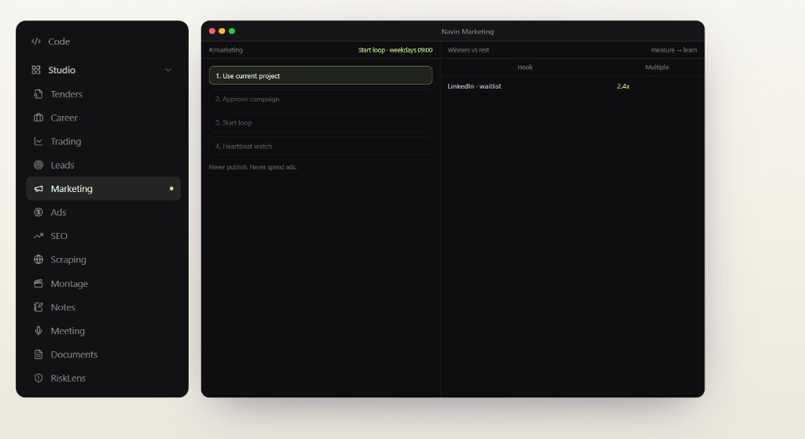
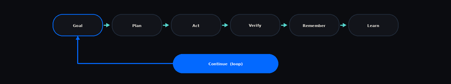

<div align="center">

<h1 align="center"> Navin</h1>

<p align="center">
  
</p>

**100% Free. Open Source. Autonomous. Built toward AGI.**

[English](./README.md) - [Français](./README.fr.md)

[](./LICENSE)
[](https://github.com/navinspire-ai/navin-agi)

Navin combines **Persistent Memory**, **Auto-Skills**, **Self-Evolve**, **World Models**, **Policy Learning**, **Multi-Agent** systems, **Loops** and **Heartbeat** to move beyond static AI assistants toward agents that improve from experience.

Code - Research - Scrape - Automate - Create - Market - Learn - Evolve

Your machine. Your models. Your agent.

<br>

[Download Navin](https://navin.live/download) - [Documentation](https://navin.live/en/docs) - [Contributing](./CONTRIBUTING.md)

<br>

⭐ Star Navin if you want AI agents you can actually own.

</div>

<p align="center">
  
</p>

## Why Navin?

Most AI tools stop after generating an answer.

Navin is built to take a goal and keep working.

<p align="center">
  
</p>

Navin runs as a desktop app and CLI, works locally, supports your own API keys and can use hundreds of text and multimodal models.

## Installation

### CLI

```bash
curl https://navin.live/install -fsS | bash
cd your-project
navin-cli
```

Windows PowerShell:

```powershell
irm 'https://navin.live/install?win32=true' | iex
```

`navin-cli` is the terminal agent. `navin .` opens the desktop on the current folder.

After launch, open **Settings** to add your keys and pick a model. In `navin-cli`, press **Ctrl+G**. The web UI is where you configure everything. You do not edit JSON by hand.

### Desktop

Download from [navin.live/download](https://navin.live/download).

<table>
  <thead>
    <tr>
      <th align="left" width="240">Platform</th>
      <th align="left">Download</th>
    </tr>
  </thead>
  <tbody>
    <tr>
      <td>
        
      </td>
      <td>
        <a href="https://navin.live/download"><code>Navin-Desktop-macos-arm64.dmg</code></a>
      </td>
    </tr>
    <tr>
      <td>
        
      </td>
      <td>
        <a href="https://navin.live/download"><code>Navin-Desktop-macos-x64.dmg</code></a>
      </td>
    </tr>
    <tr>
      <td>
        
      </td>
      <td>
        <a href="https://navin.live/download"><code>Navin-Desktop-windows-x64-setup.exe</code></a>
        &nbsp;
        <a href="https://navin.live/download"><code>.msi</code></a>
      </td>
    </tr>
    <tr>
      <td>
        
      </td>
      <td>
        <a href="https://navin.live/download"><code>.AppImage</code></a>
        &nbsp;
        <a href="https://navin.live/download"><code>.deb</code></a>
        &nbsp;
        <a href="https://navin.live/download"><code>.rpm</code></a>
        &nbsp;
        <a href="https://navin.live/download"><code>.pkg.tar.zst</code></a>
      </td>
    </tr>
  </tbody>
</table>

### From source

```bash
git clone https://github.com/navinspire-ai/navin-agi.git
cd navin-agi
sh scripts/start.sh --install
```

This starts the local web UI. Configure providers and models in Settings, then start working. Stop with `sh scripts/stop.sh`.

## Agents

Navin switches mode for the kind of work you need. It can also spawn sub-agents for parallel and specialized work.

<p align="center">
  
</p>

<table>
  <thead>
    <tr>
      <th align="left" width="160">Mode</th>
      <th align="left">Role</th>
    </tr>
  </thead>
  <tbody>
    <tr>
      <td></td>
      <td>Understand without modifying the project</td>
    </tr>
    <tr>
      <td></td>
      <td>Create an execution plan</td>
    </tr>
    <tr>
      <td></td>
      <td>Build, edit, run, test and iterate</td>
    </tr>
    <tr>
      <td></td>
      <td>Review code and propose fixes</td>
    </tr>
    <tr>
      <td></td>
      <td>Analyze and harden your application</td>
    </tr>
    <tr>
      <td></td>
      <td>Reproduce, diagnose, fix and verify</td>
    </tr>
  </tbody>
</table>

## Agent Loop

Navin does not generate code and stop.

It can use your repository, terminal, browser, files, tools and memory to continue until the work is done or genuinely blocked.

<p align="center">
  
</p>

## Loop + Heartbeat

**Loop** keeps an agent on a goal across many cycles.

**Heartbeat** wakes autonomous tasks later and lets them continue.

<p align="center">
  
</p>

Useful for coding, research, monitoring, scraping, tenders, leads, job search and long-running work.

Autonomy stays bounded by permissions, budgets, checkpoints and kill switches.

## Built toward AGI

Navin is moving beyond static assistants toward agents that learn from experience.

<p align="center">
  
</p>

<table>
  <thead>
    <tr>
      <th align="left" width="220">Capability</th>
      <th align="left">What it does</th>
    </tr>
  </thead>
  <tbody>
    <tr>
      <td></td>
      <td>Remember useful experience across sessions, projects, code, notes and actions</td>
    </tr>
    <tr>
      <td></td>
      <td>Create, test, repair and improve reusable Skills automatically</td>
    </tr>
    <tr>
      <td></td>
      <td>Predict what is likely to happen before taking an action</td>
    </tr>
    <tr>
      <td></td>
      <td>Learn which tool or action is the best next step</td>
    </tr>
    <tr>
      <td></td>
      <td>Every improvement must be measurable, testable and reversible</td>
    </tr>
  </tbody>
</table>

The goal is not just an agent that works. It is an agent that gets better at working.

Navin does not claim to be AGI today. The project is building the capabilities required to move toward increasingly general autonomous intelligence.

## Self-Evolve

When Navin fails the same way more than once, it can turn that experience into a better reusable Skill.

<p align="center">
  
</p>

The rule is simple: better than before. Nothing important gets worse.

## Memory + Graph

Navin does not have to start from zero every session.

<p align="center">
  
</p>

## One AI workspace

Navin connects many workflows to the same agent, memory and project context.

<p align="center">
  
</p>

<table>
  <thead>
    <tr>
      <th align="left" width="140">Module</th>
      <th align="left">What Navin can do</th>
    </tr>
  </thead>
  <tbody>
    <tr><td></td><td>Build, Debug, Review, Security, Git, Terminal</td></tr>
    <tr><td></td><td>Web research, multi-agent research, documents</td></tr>
    <tr><td></td><td>Crawl, extract, structure, analyze</td></tr>
    <tr><td></td><td>Find, enrich, score, qualify</td></tr>
    <tr><td></td><td>Research, strategy, content, campaigns</td></tr>
    <tr><td></td><td>Find opportunities, analyze, prepare responses</td></tr>
    <tr><td></td><td>Find jobs and freelance missions, analyze opportunities</td></tr>
    <tr><td></td><td>Record, transcribe, summarize, extract actions</td></tr>
    <tr><td></td><td>Write, search, ask, connect knowledge</td></tr>
    <tr><td></td><td>Tasks, decisions, context, agent execution</td></tr>
    <tr><td></td><td>Audit, keywords, content, actions</td></tr>
    <tr><td></td><td>Image, video, music, speech, STT, TTS</td></tr>
  </tbody>
</table>

One context. One memory. One agent system.

## Models

Use the models you want. Add keys and pick a model in **Settings**.

**Local:** Ollama - LM Studio - vLLM - OpenAI-compatible servers

**BYOK:** bring your own API keys across 28+ providers.

**Navin Providers:** 380+ text and multimodal models, including OpenAI, Anthropic, Google, xAI, Qwen, Z.ai / GLM, Kimi, MiniMax, DeepSeek, Mistral, NVIDIA and more.

Multimodal workflows: Image - Video - Music - Vision - Speech - STT - TTS

## Tools and integrations

Files - Code - Shell - Git - Browser - APIs - Databases - MCP - Plugins - SaaS

Extend Navin with Skills, MCP servers, plugins, custom tools, agent packs, workflows and integrations.

Channels: WhatsApp - Telegram - Slack - Discord - Email - Teams and more.

## Local-first

**Your machine. Your models. Your data.**

Run local models. Bring your own API keys. Use managed models only if you want them.

No mandatory cloud. No mandatory model provider.

## Safety

Sandbox execution - Checkpoints - Permissions - Human approvals - Isolated work - Resource limits - Rollback - Kill switches

More autonomy does not automatically mean more permissions.

## Documentation

[navin.live/en/docs](https://navin.live/en/docs) - [Installation](./docs/Installation.md) - [Capabilities](./docs/capabilities.md)

## Contributing

Navin is open source and contributions are welcome: agent runtime, CLI, Skills, MCP, providers, memory, world models, policy learning, evaluations, integrations, UI, documentation and bug fixes.

Please read [CONTRIBUTING.md](./CONTRIBUTING.md) before opening a pull request.

## Contributors

Built by [Navinspire IA](https://navinspire.ai) and the Navin community.

[@aymenghad](https://github.com/aymenghad) -
[@anisf](https://github.com/anisf) -
[@Amira-ben-henda-eiagen](https://github.com/Amira-ben-henda-eiagen) -
[@hasseniImen](https://github.com/hasseniImen) -
[@maryem955](https://github.com/maryem955) -
[@medkhalilklai](https://github.com/medkhalilklai) -
[@SkanderBS2024](https://github.com/SkanderBS2024) -
[@yosra-wanen](https://github.com/yosra-wanen) -
[@nabilmersni2](https://github.com/nabilmersni2)

## License

Navin is open source under the [MIT License](./LICENSE).

<div align="center">

100% Free. Open Source. Autonomous. Built toward AGI.

Plan - Act - Verify - Remember - Learn - Evolve

[Download Navin](https://navin.live/download) - [Documentation](https://navin.live/en/docs) - [Contribute](./CONTRIBUTING.md)

<br>

⭐ Star Navin if you want open-source agents that actually learn.

<br>

Your machine. Your models. Your agent.

Made by [Navinspire IA](https://navinspire.ai) - Paris

</div>

<sub>A small early upstream from [nanobot](https://github.com/HKUDS/nanobot) (MIT) is listed with other third-party notices in [THIRD_PARTY_NOTICES.md](./THIRD_PARTY_NOTICES.md).</sub>
