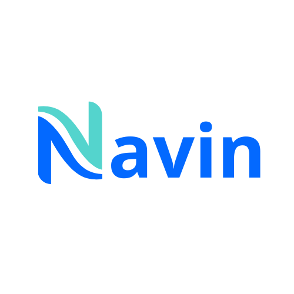

<p align="center">
  
</p>

**Navin** is an open-source, ultra-lightweight personal AI agent you can truly own. It keeps the agent core small and readable while giving you the practical pieces for real long-running work: WebUI, chat channels, tools, memory, MCP, model routing, automation, and deployment.

> GitHub: <https://github.com/EIAGEN/navin-claw>

## Start Here

| You want to... | Go to |
|---|---|
| Install navin with no terminal/config background | [Start Without Technical Background](./docs/start-without-technical-background.md) |
| Install quickly and get one CLI reply | [Install](#-install) and [Quick Start](#-quick-start) |
| Open the bundled browser UI | [WebUI](#-webui) |
| Connect Telegram, Discord, Slack, Email, Mattermost, or another chat app | [Chat Apps](./docs/chat-apps.md) |
| Configure providers, fallback models, Langfuse, MCP, web tools, or security | [Docs](./docs/README.md) and [Configuration](./docs/configuration.md) |
| Understand or extend the internals | [Architecture](./docs/architecture.md) and [Development](./docs/development.md) |

## What can navin do?

navin is a self-hosted personal AI agent runtime. It can:

- run in a browser WebUI or terminal
- connect to Telegram, Discord, Slack, Email, Mattermost, and other chat apps
- use tools such as files, shell, web search, web fetch, MCP, cron, image and video generation, and subagents
- keep session history and long-term memory through Dream
- run long-horizon goals and scheduled automations
- expose a Python SDK and OpenAI-compatible API for integrations
- deploy as a long-running local or server-side agent gateway

## 💡 Why navin

- **Persistent workflows**: goals, memory, tools, and chat context survive long-running work.
- **Chat-native reach**: WebUI, API, Telegram, Slack, Discord, Teams, email, and Mattermost.
- **Model freedom**: OpenAI-compatible APIs, local LLMs, image and video generation, search, and fallbacks.
- **Small core**: readable internals with MCP, memory, deployment, and automation built in.
- **Own your stack**: inspect, customize, self-host, and extend without a giant platform.

## 📦 Install

Prerequisites: Python 3.11 or newer. A source install needs `bun` or `npm` to build the WebUI.

If terminals, API keys, or config files are new to you, use the guided zero-background walkthrough in [Start Without Technical Background](./docs/start-without-technical-background.md) instead of this compact README path.

**Install from this repository (recommended)**

One command — installs what's missing, then starts the gateway (`:8765`) and the WebUI dev server (`:5173`) in the background:

```bash
sh scripts/start.sh            # everything (add --install to force reinstall)
sh scripts/start.sh --backend  # gateway only
sh scripts/stop.sh             # stop everything
```

Or step by step with Make, from the repository root:

```bash
# Backend: create .venv and install in editable mode
make install

# Frontend (dev server) — optional, the gateway can serve a bundled build
cd webui && make install
```

Or with plain pip from an activated virtual environment:

```bash
python -m pip install .
```

On Windows, if pip reports that it cannot launch `npm`, run `cd webui`, `npm.cmd install --package-lock=false`, `npm.cmd run build`, and `cd ..` in order, then retry the install. Contributors who need an editable checkout should follow [`webui/README.md`](./webui/README.md) and [`AGENTS.md`](./AGENTS.md).

Verify the install:

```bash
navin --version
```

If `navin` is not on `PATH`, use the executable from the environment where it was installed (e.g. `.venv/bin/navin`).

**Windows — navin.exe (all-in-one)**

Download `navin.exe` from the [releases](https://github.com/EIAGEN/navin-claw/releases) and double-click it: it installs Python if needed, sets up Navin in `~/.navin/venv`, then starts the gateway and opens the WebUI — everything else (provider, model, channels) is configured directly in the platform. `navin.exe --update` upgrades; `navin.exe <command>` proxies any CLI command. Standalone bundles with Python included (`navin-windows-x64.zip`, `navin-linux-x64.tar.gz`, `navin-macos-arm64.tar.gz`) are published alongside — build them locally with `make binary` (current OS) or `make exe` (Windows launcher, from WSL/Windows). See [`packaging/`](./packaging/README.md).

## 🚀 Quick Start

**1. Start the platform**

```bash
navin webui
```

This creates `~/.navin/config.json` and `~/.navin/workspace/` with safe local defaults, starts the gateway, and opens the WebUI. An alert at the top of the platform then guides you to **Settings → Providers** to add your API key and pick a model — no terminal wizard needed.

**2. Configure manually (optional)** (`~/.navin/config.json`)

Skip this step if you configured the provider and model in the platform (Settings → Providers).

Configure these **two parts** in the config file. Add or merge the following blocks into the existing file instead of replacing the whole file.

The example below uses a generic OpenAI-compatible `custom` provider so the compact path does not recommend one hosted service. Provider examples are recipes, not rankings or endorsements. For copyable provider-specific setup, see [Provider Cookbook](./docs/provider-cookbook.md).

*Set your API key*:

```json
{
  "providers": {
    "custom": {
      "apiKey": "your-api-key",
      "apiBase": "https://api.example.com/v1"
    }
  }
}
```

*Set a model preset and make it active*:

```json
{
  "modelPresets": {
    "primary": {
      "label": "Primary",
      "provider": "custom",
      "model": "model-id-from-your-provider",
      "maxTokens": 8192,
      "contextWindowTokens": 200000,
      "temperature": 0.1
    }
  },
  "agents": {
    "defaults": {
      "modelPreset": "primary"
    }
  }
}
```

Direct `agents.defaults.provider` and `agents.defaults.model` still work for existing configs, but named presets are the recommended path because they also power `/model` switching and `fallbackModels`.

For another provider, the same config shape still applies:

| Replace | Where |
|---|---|
| Provider config key | `providers.<provider>` |
| API key | `providers.<provider>.apiKey` |
| Preset provider name | `modelPresets.primary.provider` |
| Model ID | `modelPresets.primary.model` |
| Endpoint URL, only when needed | `providers.<provider>.apiBase` |

**3. Open the WebUI**

```bash
navin gateway
```

Leave the terminal open and visit `http://127.0.0.1:8765`. You can also use `navin webui`, which prepares the local WebSocket channel if needed, starts the gateway, and opens the browser automatically. The first-run WebUI binds to `127.0.0.1` by default, so it is not exposed to your LAN. Prefer not to keep a terminal open? Use `navin gateway --background`, then manage it with `navin gateway status`, `logs`, `restart`, and `stop`.

For manual or terminal-only setup, test one CLI message:

```bash
navin status
navin agent -m "Hello!"
```

In `navin status`, it is normal for most providers to say `not set`. The active preset's provider should be configured, and `Config` plus `Workspace` should show check marks.

If that works, start an interactive chat:

```bash
navin agent
```

Need help with `PATH`, API keys, provider/model matching, or JSON errors? See the fuller [Install and Quick Start](./docs/quick-start.md) and [Troubleshooting](./docs/troubleshooting.md).

- Want a pasteable provider setup? See [Provider Cookbook](./docs/provider-cookbook.md)
- Want to understand provider/model matching? See [Providers and Models](./docs/providers.md)
- Want web search, MCP, security settings, or more config options? See [Configuration](./docs/configuration.md)
- Want to run locally? See [Ollama](./docs/providers.md#ollama), [vLLM or another local OpenAI-compatible server](./docs/providers.md#vllm-or-other-local-openai-compatible-server), and the full [provider reference](./docs/configuration.md#providers).
- Want to run navin in chat apps like Telegram, Discord, or Slack? See [Chat Apps](./docs/chat-apps.md)
- Want Docker or Linux service deployment? See [Deployment](./docs/deployment.md)

## 🌐 WebUI

The WebUI is the browser workbench for chat sessions, workspace controls, Apps, Skills, Automations, and settings. For the full user guide, see [`docs/webui.md`](./docs/webui.md).

**Open it**

```bash
navin webui
```

The command enables the local WebSocket channel after confirmation, starts the gateway, and opens `http://127.0.0.1:8765`. If needed, run `navin gateway` and open that address manually. To open it from another device on your LAN, see [WebUI docs -> LAN access](./docs/webui.md#lan-access).

The WebUI is served by the WebSocket channel on port `8765` by default. The gateway's `18790` port is for the health endpoint, not the browser UI.

> [!TIP]
> Working on the WebUI itself? Check out [`webui/README.md`](./webui/README.md) for the source-tree, Vite dev server, and build workflow.

## 🏗️ Architecture

navin stays lightweight by centering everything around a small agent loop: messages come in from chat apps, the LLM decides when tools are needed, and memory or skills are pulled in only as context instead of becoming a heavy orchestration layer. That keeps the core path readable and easy to extend, while still letting you add channels, tools, memory, and deployment options without turning the system into a monolith.

For the source-level map, see [Architecture](./docs/architecture.md).

## 📚 Docs

Browse the [repo docs](./docs/README.md):

- Use task-oriented guides: [Guides](./docs/guides/README.md)
- Start with no technical background: [Start Without Technical Background](./docs/start-without-technical-background.md)
- Start from zero with developer basics: [Install and Quick Start](./docs/quick-start.md)
- Understand the runtime model: [Concepts](./docs/concepts.md)
- Read the source-level map: [Architecture](./docs/architecture.md)
- Choose a provider/model: [Providers and Models](./docs/providers.md)
- Copy provider setup recipes: [Provider Cookbook](./docs/provider-cookbook.md)
- Debug setup and runtime failures: [Troubleshooting](./docs/troubleshooting.md)
- Talk to your navin with familiar chat apps: [Chat App AI Agent](./docs/guides/chat-app-ai-agent.md) · [Chat Apps](./docs/chat-apps.md)
- Schedule or trigger agent work: [Automations](./docs/automations.md)
- Configure providers, web search, MCP, and runtime behavior: [Configuration](./docs/configuration.md)
- Integrate navin with local tools and automations: [OpenAI-Compatible API](./docs/openai-api.md) · [Python SDK](./docs/python-sdk.md)
- Run navin with Docker or as a Linux service: [Deployment](./docs/deployment.md)

## 🤝 Contribute

The codebase is intentionally small and readable. See [AGENTS.md](./AGENTS.md) for local development guidance and [`.agent/design.md`](./.agent/design.md) for architectural constraints.

<p align="center">
  <em>Thanks for visiting ✨ navin!</em>
</p>
