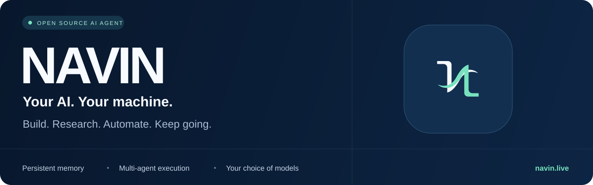
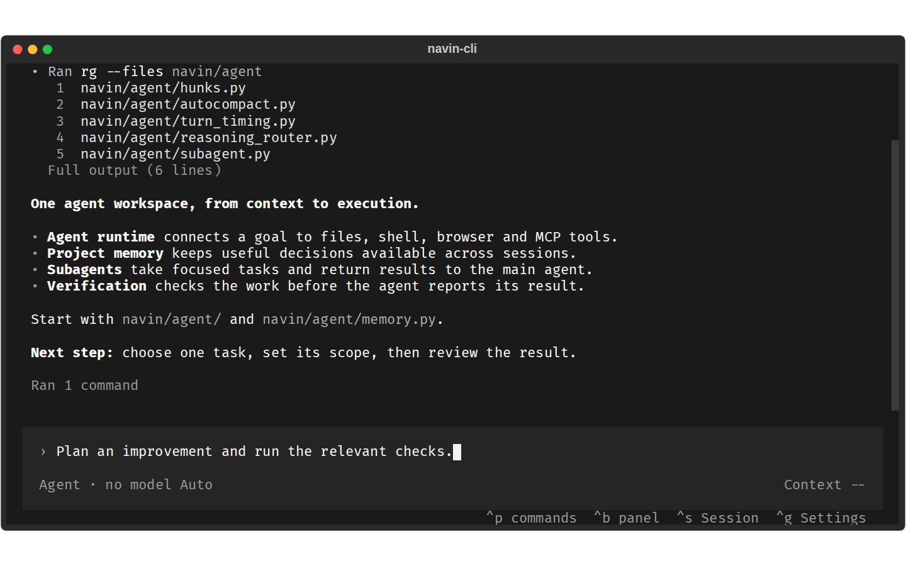

<div align="center">



# Gör ett mål till utfört arbete.

**En arbetsmiljö med öppen källkod för AI-agenter som kan skriva kod, göra research, använda verktyg och behålla sammanhang mellan sessioner.**

Kör i terminalen, webbläsaren eller skrivbordsappen. Välj dina modeller. Behåll kontrollen.

[English](./README.md) · [Français](./README.fr.md) · [العربية](./README.ar.md) · [Español](./README.es.md) · [Português](./README.pt-BR.md) · [Deutsch](./README.de.md) · [简体中文](./README.zh-CN.md) · [日本語](./README.ja.md) · [한국어](./README.ko.md) · [Svenska](./README.sv.md)

[](./LICENSE) [](./docs/configuration.md) [](https://github.com/Navinspire-ia/navin/stargazers)

**[Kom igång](#kom-igång)** · **[Ladda ner skrivbordsappen](https://navin.live/download)** · **[Dokumentation](./docs/README.md)** · **[Bidra](./CONTRIBUTING.md)**

</div>

## Ge Navin ett uppdrag

> ”Hitta orsaken till den här buggen, rätta den, kör relevanta tester och förklara ändringarna.”

> ”Undersök de här konkurrenterna, jämför deras erbjudanden med källhänvisningar och sammanställ en rapport.”

> ”Håll koll på projektet och meddela mig när något förändras som jag behöver agera på.”

Navin kopplar modellen till dina filer, terminalen, webbläsaren och dina verktyg. Den kan planera arbetet, delegera avgränsade uppgifter till underagenter, kontrollera resultaten och fortsätta inom de gränser du har ställt in.

**Arbetet lämnar något att bygga vidare på:** projektkunskap, beslut, återanvändbara färdigheter och sammanhang.

## Kom igång

**Linux / macOS / WSL**

```bash
curl https://navin.live/install -fsS | bash
```

**Windows PowerShell**

```powershell
irm 'https://navin.live/install?win32=true' | iex
```

Öppna en terminal i ditt projekt:

```bash
cd your-project
navin-cli
```

1. Öppna **Settings** med **Ctrl+G** och konfigurera din API-nyckel eller adressen till en lokal modell.
2. Välj modell och läge: **Ask**, **Plan**, **Agent**, **Review**, **Security** eller **Debug**.
3. Prova: **”Läs projektet och förklara hur det fungerar. Föreslå sedan en användbar förbättring.”**

Föredrar du ett fönster? [Ladda ner Navin Desktop för Windows, macOS eller Linux](https://navin.live/download).

Programvaran är gratis att använda enligt villkoren i licensen för öppen källkod. Externa modell-API:er och anslutna tjänster kan ta betalt för användningen. [Installation och felsökning](./docs/Installation.md).

### Installera från källkoden (gateway + WebUI)

För att köra eller ändra Navin på din dator:

```bash
git clone https://github.com/Navinspire-ia/navin.git
cd navin
make install
make start
```

`make install` installerar saknade systempaket där det stöds, Python-backend och WebUI. `make start` startar gatewayen och WebUI på [localhost:5173](http://localhost:5173).

Om du hoppar över systeminstallationen (`NAVIN_SKIP_SYSTEM=1` eller `sh scripts/install.sh --no-system`), installera först **Python 3.11+, Git, Make, Node.js 18+ och npm**.

På Linux/macOS behöver den inbyggda sandlådan också **rustup** (`make native`).

CLI från kodarkivet: `.venv/bin/navin-cli` (Windows: `.venv\Scripts\navin-cli`). [Fullständig installationsguide](./docs/Installation.md).

## En arbetsmiljö för många slags uppgifter

| Du vill... | Navin erbjuder |
| --- | --- |
| **Utveckla programvara** | Utforska kodarkivet, redigera kod, använda terminal och Git, förhandsgranska i webbläsaren, testa och granska. |
| **Förstå en kodbas** | Projektgraf, kodindex, definitioner, referenser och analys av hur ändringar påverkar projektet. |
| **Göra research och hämta data** | Webbsökning, webbläsarverktyg, skrapning, strukturerad extraktion och rapporter med källor. |
| **Skapa leveranser** | Dokument, presentationer, kalkylblad, arkitekturdiagram och arbetsflöden för medieproduktion. |
| **Utveckla verksamheten** | Prospektering, komplettering av kunduppgifter, SEO, marknadsundersökningar och kampanjförberedelser. |
| **Hantera yrkesrelaterade uppgifter** | Analys av upphandlingar, jobbsökning, mötestranskribering, anteckningar och åtgärdspunkter. |
| **Fördela större uppgifter** | Underagenter som arbetar parallellt och återför resultaten till huvudagenten. |
| **Fortsätta över tid** | Målinriktade loopar, schemalagda uppgifter och Heartbeat-kontroller medan gatewayen körs. |

Vissa arbetsflöden kräver extra beroenden, konfigurerade integrationer eller en kompatibel modell. Se [funktionsöversikten](./docs/capabilities.md) för detaljer.

<p align="center">

<br><sub>Förhandsvisning av CLI med en exempelgenomgång av ett kodarkiv.</sub>
</p>

## Varför prova Navin?

**Sammanhang som finns kvar efter samtalet.** Projektminnet och kodgrafen hjälper agenten att återfinna beslut och relevanta filer. Ett valfritt episodiskt minne gör det möjligt att återkalla tidigare arbete. [Minne](./docs/memory.md) · [Projektgraf](./docs/navin_dev/en/graph.md)

**Verktyg som utför arbetet.** Filer, skal, Git, webbläsare, API:er och MCP kopplar resonemang till handling. Skills samlar återanvändbara arbetssätt; insticksprogram och integrationer utökar verktygen. [Konfigurera MCP](./docs/guides/configure-mcp-tools.md) · [Skills](./navin/skills/README.md)

**Du väljer modellerna.** Anslut OpenAI, Anthropic, Google, Mistral, DeepSeek, Qwen och andra leverantörer, eller lokala modeller via Ollama, LM Studio och vLLM. Använd olika modeller för olika uppgifter. Tillgängliga funktioner beror på vald leverantör och modell. [Konfiguration](./docs/configuration.md)

**Självständigt arbete med tydliga gränser.** Loopar driver ett mål framåt, medan Heartbeat letar efter värdefulla uppföljningar. Godkännanden, resursbudgetar, kontrollpunkter och stoppfunktioner begränsar körningen. [Automatisering](./docs/automations.md) · [Säkerhet](./SECURITY.md)

Vid lokal körning ligger arbetsmiljön kvar på din dator. Om du väljer en fjärrmodell eller en ansluten tjänst skickas de uppgifter som behövs för förfrågan till den tjänsten.

## Från mål till verifierat resultat

<p align="center">

</p>

[Ladda ner det interaktiva diagrammet](./assets/readme/agent-workflow.html) och öppna HTML-filen i webbläsaren. Diagrammet och dess kontroller är på engelska.

## En agent som kan lära av erfarenhet

Navin har experimentella inlärningsfunktioner som du kan välja att aktivera:

| Funktion | Vad den utforskar |
| --- | --- |
| **Self-Evolve / Auto-Skills** | Omvandla upprepade misslyckanden till förslag på nya färdigheter, utvärdera dem och ta dem i bruk eller återställa dem. |
| **World model** | Lära sig lokala förutsägelser om verktygsresultat från registrerade körförlopp. |
| **Policy learning** | Utvärdera förslag på nästa handling mot fall som har reserverats för utvärdering. |

Dessa funktioner är **avstängda som standard**. Utvärderingskrav styr aktiveringen, och att publicera en färdighet för alla projekt kräver en mänsklig handling. Funktionerna finjusterar inte samtalsmodellen.

Ambitionen är allt mer kapabla självständiga agenter. **Navin hävdar inte att projektet har uppnått AGI.**

[Utveckling av Skills](./docs/skills-evolution.md) · [World model](./docs/world-model.md) · [Policy learning](./docs/policy.md)

## Anslut verktygen du redan använder

- **Modeller:** egna API-nycklar eller lokal inferens.
- **Tillägg:** MCP-servrar, Skills, insticksprogram och egna verktyg.
- **Kanaler:** Telegram, Slack, Discord, WhatsApp, e-post, Teams och fler genom konfigurerade integrationer.
- **Gränssnitt:** CLI, WebUI och nedladdningsbara skrivbordsappar.

Det här kodarkivet innehåller den publika agentmotorn, CLI, WebUI och tillhörande verktyg. Paketeringen av skrivbordsappar, tjänsten navin.live, webbplatsens infrastruktur och publiceringen av versioner hanteras separat.

## Bygg Navin tillsammans med oss

Prova en riktig uppgift. Berätta var agenten hjälpte dig och var den körde fast.

- [Rapportera en reproducerbar bugg eller föreslå en funktion](https://github.com/Navinspire-ia/navin/issues).
- Lägg till en leverantör, förbättra en Skill, bygg en integration eller bidra med ett utvärderingsfall.
- Förbättra en översättning eller dela ett arbetsflöde som andra kan återskapa.
- Läs [CONTRIBUTING.md](./CONTRIBUTING.md) och [CLA](./CLA.md) innan du skickar en pull request.

Skapat av [Navinspire IA](https://navinspire.ai), underhållet av [@aymenghad](https://github.com/aymenghad) och [Navins bidragsgivare](https://github.com/Navinspire-ia/navin/graphs/contributors).

## Licens

[AGPL-3.0](./LICENSE), med möjlighet till [kommersiell licens](./COMMERCIAL_LICENSE.md) från Navinspire IA. Bidrag omfattas av [Contributor License Agreement](./CLA.md).

<div align="center">

**Ge ditt nästa projekt mer självständighet.**

[Installera Navin](#kom-igång) · [Läs dokumentationen](./docs/README.md) · [Ge projektet en stjärna](https://github.com/Navinspire-ia/navin)

Om Navin hjälper dig gör en stjärna det lättare för andra att upptäcka projektet.

</div>
