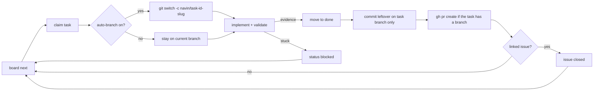

# Board Autonomy

Turn the task board into a self-driving delivery pipeline. With one explicit consent, the agent chains through ready tasks, can isolate a task on its own git branch when you turn that on, opens a pull request when the task is done, and keeps GitHub issues in sync - while you keep the final word on every merge.

Autonomy is **per project**, **opt-in**, and **recorded**: nothing changes until you enable it, and everything it does leaves a visible trail (branch, PR link, issue link, timeline entries, notifications).

## What you get

| Capability | What happens | Where you see it |
| --- | --- | --- |
| Chained execution | During a run you started (Run agent, `/board task`, `/forge`, `/cruise`, `/mission`, board loop), the agent picks the next ready task and keeps going instead of stopping after each card | Kanban cards move live; timeline entries per action |
| Isolated branch per task | `board claim` creates and switches to `navin/task-<id>-<slug>`; your current branch is never committed to | Branch chip on the task card, `Git / GitHub` section in the task detail |
| Pull request on done | Moving a task to `done` commits leftover work, pushes the branch, and runs `gh pr create` | PR link on the card and in the task detail, success notification |
| GitHub issues sync | Import open issues as tasks, create mirror issues for tasks, auto-close the linked issue when the task is done | Issue link on the card, `Sync GitHub` button, Issues tab in Project Home |
| Notifications | Claim, blocked, PR opened, issues imported | WebUI notification centre |

## Enabling it (consent dialog)

Open the **Tasks** panel (Code workbench or Project Home) and click **Autonomy** in the board header. A consent dialog explains exactly what the agent will be allowed to do:

The **Guardrails** panel in the rail (Code workbench) always shows the real state of every permission, project and machine, which branch you are on, and whether claiming a task will move you off it. Everything is toggleable there without going through the dialog again. Episodic memory, [skills evolution](../../skills-evolution.md) and the [world model](../../world-model.md) have their own **AGI** entry in the rail, right after **Terminal**.

- create, update and move tasks itself (to do, doing, blocked, done) with evidence;
- pick the next ready task and keep working until the queue is empty or a task blocks;
- notify you on claim, blocked, opened PR and imported issues.

Then it lets you pick each git capability individually:

- **Isolated branch per task** - claiming a task creates and switches to `navin/task-<id>`, so your current branch is never touched. Off by default, because a branch move you did not ask for is only discovered on your next commit: without this toggle the agent commits where you already are. When it is on, the switch is notified naming both branches.
- **Pull request on done** - when a task reaches `done`, its branch is pushed and a PR is opened for your review (requires the `gh` CLI).
- **GitHub issues sync** - the agent may create issues mirroring tasks and close them when the task is done.
- **Fix issues autonomously** - the agent may fix a GitHub issue end to end: reproduce, fix on an isolated branch, run the tests until green, commit, then close the issue and re-sync the board. Off by default.
- **Autopilot loop** - a session-bound cron job processes the board continuously, one ready task per cycle, even without a chat open. Ticking it sends `/board loop` to the agent (which creates the cron); unticking asks the agent to remove it. Off by default.

Confirming writes your consent, with a timestamp, into the project itself:

```json
// <project>/.navin/board/settings.json
{
  "schema_version": 1,
  "autonomy": {
    "enabled": true,
    "consented_at": "2026-08-04T23:18:52Z",
    "auto_branch": false,
    "open_pr_on_done": true,
    "sync_github_issues": false,
    "fix_issues": false,
    "autopilot_loop": false,
    "issues_repo": null
  },
  "updated_at": "2026-08-04T23:18:52Z",
  "updated_by": "user"
}
```

Because the file lives under `.navin/board/`, the consent travels with the repository and is shared by Code and every studio. Click the toggle again to disable; a fresh enable records a new consent timestamp.

## Task lifecycle under autonomy



Details that make it safe and robust:

- **Idempotent branching** - if the task branch already exists (a resumed run), the agent switches back to it instead of creating a duplicate. A dirty but unconflicted working tree is preserved by `git switch -c`.
- **Never on your branch** - leftover changes are auto-committed only when the repo is on a `navin/task-*` branch. Work sitting on `main` or your feature branch is never swept into a task commit.
- **Existing PR reused** - if a PR already exists for the branch, its URL is recorded instead of opening a duplicate.
- **Evidence gate still applies** - `done` with `validation=test|lint|verify` still requires evidence. Autonomy does not weaken the definition of done.
- **Repo state respected** - mid-merge, mid-rebase, or mid-cherry-pick repositories refuse auto-branching with a clear message instead of corrupting state.
- **Everything is best-effort** - no `gh`, no remote, no network: the board keeps working and the reason is recorded as a task comment (`Auto-PR skipped: ...`).

## GitHub issues sync

Three directions, all deduplicated by issue URL:

| Action | How | Result |
| --- | --- | --- |
| Import open issues as tasks | **Sync GitHub** button on the board, or agent action `board sync_github` | One task per open issue not on the board yet, labeled `github` plus the issue labels, `issue_url` linked |
| Create the mirror issue for one task | `board sync_github task_id=<id>` | Issue created with the task description, acceptance and evidence; URL saved on the task |
| Close on done | Automatic when the task has a linked issue and issues sync is enabled | Issue closed with a comment |

The **Issues tab** in [Project Home](./project-home.md) lists the repository's issues (open / closed / all) with author, labels and comment counts, and has its own **Import to board** button.

### Following another repository's issues

By default the issues shown are those of the selected project folder's GitHub remote. A project may however follow another repository's tracker: an upstream you do not own, a public repository whose bugs you fix, an issue-only repository kept apart from the code.

The selector in the Issues tab header shows the current source (`this project` or `owner/name`). Click it, paste `owner/name` or a `github.com` URL, confirm: the list, the **Import to board** button and the agent all target that repository. Leave the field empty (or click **Back to the project remote**) to go back to the folder's own remote.

The choice is persisted per project in `.navin/board/settings.json`, under `autonomy.issues_repo`:

```json
{
  "autonomy": {
    "issues_repo": "acme/widgets"
  }
}
```

What to keep in mind:

- **The board stays the project's own.** Imported issues become tasks in `<project>/.navin/board/`, still deduplicated by issue URL.
- **The code stays local.** Fixing an external repository's issue works on the current project checkout: it is up to you to make sure that is the code in question (a fork, a submodule, a separate code repository).
- **`gh` is still required, authenticated.** Even to read a public repository, the GitHub CLI must be installed and logged in (`gh auth login`): Navin stores no token.
- **The agent knows.** When an external repository is configured and issue sync (or fixing) is consented, the runtime context tells the agent to target that repository (`gh ... --repo owner/name`) instead of the local remote.

### Fixing an issue with the agent

Every open issue in the Issues tab has a **Fix with agent** button. Clicking it sends the agent a precise brief: reproduce the problem, implement the fix on an isolated task branch, run the relevant tests until they are fully green, commit, open a PR when PR-on-done is enabled, and only then close the issue on GitHub (`gh issue close <n> --comment`) and re-sync the board. The agent is explicitly instructed to never close an issue whose fix is not tested and committed.

The same behaviour is available autonomously (without a click) when the **Fix issues autonomously** consent option is ticked: the runtime context then authorizes the agent to pick up linked issues during runs and drive them to a tested, committed, closed state.

## What the agent knows

When autonomy is on, every agent turn receives a Runtime Context digest, for example:

```
Board autonomy is ENABLED for this project (user consent recorded 2026-08-04T23:18:52Z).
During a run you were invited into, chain through ready board tasks without asking
again per task; stop and notify on blocked.
Work each claimed task on its isolated navin/task-<id> branch (created automatically
at claim; never commit to the user's starting branch).
When a task reaches done: commit, push its branch and open a pull request
(gh pr create), then record the PR URL on the task.
Destructive git operations (force-push, hard reset, deletes) still require explicit
user approval.
```

The `/forge`, `/cruise` and `/mission` workflows load the `git` and `github` skills and follow this protocol; the `project-board` skill documents it for every other run.

## Design decisions

Two structural choices define how autonomy behaves, both picked for the best power / safety balance:

| Question | Chosen | Why |
| --- | --- | --- |
| When does autonomy act? | **Run-scoped by default, continuous loop opt-in** | Ticking the toggle starts nothing by itself: the agent chains ready tasks only during runs you launch. No daemon codes behind your back. The separate **Autopilot loop** option in the consent dialog (off by default) creates an explicit session-bound cron when you want continuous processing. |
| How is a task isolated? | **Named branch + push + PR at the end** (`navin/task-<id>-<slug>`) | Compared to a bare branch, the PR gives you a mandatory review gate: the agent never merges. Compared to a hidden worktree under `~/.navin/worktrees`, everything stays visible in your repository and in the workbench, with nothing to clean up. |

## Guarantees and limits

- The agent **never merges pull requests**. Review and merge stay with you.
- Destructive git operations (force-push, hard reset, branch deletion) still go through the normal approval flow, autonomy or not.
- **Never lose work, by construction.** The autonomy plumbing only ever uses creating and preserving commands: `git switch -c`, `git switch`, `git add`, `git commit`, `git push -u` (never forced). There is no `reset`, no `clean`, no forced push, no branch delete anywhere in it, and a dedicated regression test fails the build if one is ever added. `git switch` itself refuses to move when it would overwrite conflicting local changes.
- **Raw shell is covered too.** The git tool asks before `push --force` and `reset --hard`; when the operator enables the built-in deny set (Settings > Security > Agent permissions), the same commands typed through the shell (`git reset --hard`, `git clean -f/-d/-x`, `git push --force`, `git branch -d/-D`, `git checkout -f`) are intercepted and pause for your approval instead of running.
- Autonomy applies to **runs you start**. The board does not run itself in the background unless you enable the **Autopilot loop** option.
- A machine-wide kill-switch overrides every project (next section).

## Global kill-switch (operator config)

**Settings > Security > Git** exposes two machine-wide toggles: **Task auto-branch** and **Pull request on task done**. Turning one off disables that automation for **every** project, regardless of per-project consent. The same switches live in `~/.navin/config.json`:

```json
{
  "tools": {
    "boardGit": {
      "autoBranchEnabled": false,
      "openPrEnabled": false
    }
  }
}
```

Both default to `true`. When a switch is off, the consent dialog shows a warning and the corresponding automation is skipped silently at runtime.

## Git trail

Each task carries an auditable git trail:

| Field | Content |
| --- | --- |
| `branch` | `navin/task-<id>-<slug>` created at claim |
| `pr_url` | Pull request opened at done |
| `issue_url` | Linked GitHub issue (imported or mirrored) |

Consent, GitHub import and the Issues list are all in the Board UI. No separate HTTP setup is required.

## FAQ

**Does enabling autonomy start work immediately?** No. It changes what happens *during* runs you start. Launch `/cruise`, `/mission`, or Run agent on board to see it chain.

**What if my project is not a git repository?** Branching and PRs are skipped with an explanatory task comment; task chaining and issue-less features still work.

**Which CLI does it need?** Git for branching; the [GitHub CLI (`gh`)](https://cli.github.com), authenticated, for PRs and issues.

## Related

- [Project Home](./project-home.md) - Tasks, Issues, 360 Vision and Graph tabs
- [Plan Mode](./plan-mode.md) - mission ledger, `/blueprint` `/forge` `/cruise` `/mission`
- [Workbench](./workbench.md) - the Code side of the same board
