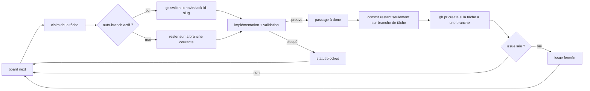

# Autonomie du board

Transformez le board de tâches en pipeline de livraison autonome. Avec un consentement explicite unique, l'agent enchaîne les tâches prêtes, peut isoler une tâche sur sa propre branche git si vous activez cette option, ouvre une pull request quand la tâche est terminée et garde les issues GitHub synchronisées - tout en vous laissant le dernier mot sur chaque merge.

L'autonomie est **par projet**, **opt-in** et **tracée** : rien ne change tant que vous ne l'activez pas, et tout ce qu'elle fait laisse une piste visible (branche, lien PR, lien issue, entrées timeline, notifications).

## Ce que vous obtenez

| Capacité | Ce qui se passe | Où vous le voyez |
| --- | --- | --- |
| Exécution enchaînée | Pendant un run que vous lancez (Run agent, `/board task`, `/forge`, `/cruise`, `/mission`, loop board), l'agent prend la tâche prête suivante et continue au lieu de s'arrêter après chaque carte | Les cartes kanban bougent en direct ; entrées timeline par action |
| Branche isolée par tâche | `board claim` crée et bascule sur `navin/task-<id>-<slug>` ; aucun commit n'atterrit sur votre branche courante | Puce branche sur la carte, section `Git / GitHub` dans le détail de la tâche |
| Pull request au done | Passer une tâche à `done` committe le travail restant, pousse la branche et exécute `gh pr create` | Lien PR sur la carte et dans le détail, notification de succès |
| Sync des issues GitHub | Import des issues ouvertes en tâches, création d'issues miroirs, fermeture automatique de l'issue liée quand la tâche est faite | Lien issue sur la carte, bouton `Sync GitHub`, onglet Issues de Project Home |
| Notifications | Claim, blocked, PR ouverte, issues importées | Centre de notifications de la WebUI |

## Activation (dialog de consentement)

Ouvrez le panneau **Tasks** (workbench Code ou Project Home) et cliquez **Autonomy** dans l'entête du board. Un dialog de consentement explique exactement ce que l'agent aura le droit de faire :

Le panneau **Garde-fous** du rail (workbench Code) montre en permanence l'état réel de chaque permission, projet et machine, la branche sur laquelle vous êtes, et si réclamer une tâche vous en fera sortir. Tout y est basculable sans repasser par le dialog.

- créer, mettre à jour et déplacer les tâches lui-même (à faire, en cours, bloquée, terminée) avec preuve ;
- prendre la tâche prête suivante et continuer jusqu'à vider la file ou rencontrer un blocage ;
- vous notifier au claim, en cas de blocage, à l'ouverture d'une PR et à l'import d'issues.

Puis il vous laisse choisir chaque capacité git individuellement :

- **Branche isolée par tâche** - réclamer une tâche crée et bascule sur `navin/task-<id>` : votre branche courante n'est jamais touchée. Désactivé par défaut, parce qu'un déplacement de branche que vous n'avez pas demandé se découvre au commit suivant : sans ce toggle, l'agent committe là où vous êtes déjà. Quand il est actif, le changement de branche est notifié en nommant les deux branches.
- **Pull request au done** - quand une tâche passe à `done`, sa branche est poussée et une PR est ouverte pour votre review (nécessite le CLI `gh`).
- **Sync des issues GitHub** - l'agent peut créer des issues miroirs des tâches et les fermer quand la tâche est faite.
- **Corriger les issues en autonomie** - l'agent peut corriger une issue GitHub de bout en bout : reproduire, corriger sur une branche isolée, lancer les tests jusqu'au vert, commit, puis fermer l'issue et re-synchroniser le board. Désactivé par défaut.
- **Autopilot loop** - un cron lié à la session traite le board en continu, une tâche prête par cycle, même sans chat ouvert. Cocher envoie `/board loop` à l'agent (qui crée le cron) ; décocher lui demande de le supprimer. Désactivé par défaut.

Confirmer écrit votre consentement, horodaté, dans le projet lui-même :

```json
// <projet>/.navin/board/settings.json
{
  "schema_version": 1,
  "autonomy": {
    "enabled": true,
    "consented_at": "2026-08-04T23:18:52Z",
    "auto_branch": false,
    "open_pr_on_done": true,
    "sync_github_issues": false,
    "fix_issues": false,
    "autopilot_loop": false,
    "issues_repo": null
  },
  "updated_at": "2026-08-04T23:18:52Z",
  "updated_by": "user"
}
```

Le fichier vivant sous `.navin/board/`, le consentement voyage avec le dépôt et est partagé entre Code et tous les studios. Recliquez le toggle pour désactiver ; une réactivation enregistre un nouveau timestamp de consentement.

## Cycle de vie d'une tâche sous autonomie



Les détails qui le rendent sûr et robuste :

- **Branchement idempotent** - si la branche de la tâche existe déjà (run repris), l'agent rebascule dessus au lieu de créer un doublon. Un arbre de travail modifié mais sans conflit est préservé par `git switch -c`.
- **Jamais sur votre branche** - les changements restants ne sont auto-committés que si le dépôt est sur une branche `navin/task-*`. Du travail posé sur `main` ou votre branche de feature n'est jamais embarqué dans un commit de tâche.
- **PR existante réutilisée** - si une PR existe déjà pour la branche, son URL est enregistrée au lieu d'en ouvrir un doublon.
- **La preuve reste obligatoire** - `done` avec `validation=test|lint|verify` exige toujours une preuve. L'autonomie n'affaiblit pas la définition de terminé.
- **État du dépôt respecté** - un dépôt en plein merge, rebase ou cherry-pick refuse l'auto-branche avec un message clair au lieu de corrompre l'état.
- **Tout est best-effort** - pas de `gh`, pas de remote, pas de réseau : le board continue de fonctionner et la raison est consignée en commentaire de tâche (`Auto-PR skipped: ...`).

## Sync des issues GitHub

Trois directions, toutes dédupliquées par URL d'issue :

| Action | Comment | Résultat |
| --- | --- | --- |
| Importer les issues ouvertes en tâches | Bouton **Sync GitHub** du board, ou action agent `board sync_github` | Une tâche par issue ouverte absente du board, labellisée `github` plus les labels de l'issue, `issue_url` liée |
| Créer l'issue miroir d'une tâche | `board sync_github task_id=<id>` | Issue créée avec la description, l'acceptance et la preuve de la tâche ; URL sauvée sur la tâche |
| Fermeture au done | Automatique quand la tâche a une issue liée et que la sync est activée | Issue fermée avec un commentaire |

L'**onglet Issues** de [Project Home](./project-home.md) liste les issues du dépôt (ouvertes / fermées / toutes) avec auteur, labels et nombre de commentaires, et a son propre bouton **Importer dans le board**.

### Suivre les issues d'un autre dépôt

Par défaut, les issues affichées sont celles du remote GitHub du dossier de projet sélectionné. Un projet peut pourtant suivre le tracker d'un autre dépôt : un upstream que vous ne possédez pas, un dépôt public dont vous corrigez les bugs, un dépôt d'issues séparé du code.

Le sélecteur de l'entête de l'onglet Issues affiche la source courante (`ce projet` ou `owner/name`). Cliquez-le, collez `owner/name` ou une URL `github.com`, validez : la liste, le bouton **Importer dans le board** et l'agent visent alors ce dépôt. Laissez le champ vide (ou cliquez **Revenir au remote du projet**) pour repasser sur le remote du dossier.

Le choix est persisté par projet dans `.navin/board/settings.json`, sous `autonomy.issues_repo` :

```json
{
  "autonomy": {
    "issues_repo": "acme/widgets"
  }
}
```

Ce qu'il faut savoir :

- **Le board reste celui du projet.** Les issues importées deviennent des tâches dans `<projet>/.navin/board/`, toujours dédupliquées par URL d'issue.
- **Le code reste local.** Corriger une issue d'un dépôt externe travaille sur le checkout du projet courant : à vous de vérifier que c'est bien le code concerné (fork, sous-module, dépôt de code séparé).
- **`gh` reste requis, authentifié.** Même pour un dépôt public en lecture, le CLI GitHub doit être installé et connecté (`gh auth login`) : Navin ne stocke aucun token.
- **L'agent est au courant.** Quand un dépôt externe est configuré et que la sync (ou la correction) d'issues est consentie, le Runtime Context lui indique de cibler ce dépôt (`gh ... --repo owner/name`) au lieu du remote local.

### Corriger une issue avec l'agent

Chaque issue ouverte de l'onglet Issues a un bouton **Corriger avec l'agent**. Le clic envoie à l'agent un brief précis : reproduire le problème, implémenter la correction sur une branche de tâche isolée, lancer les tests concernés jusqu'à ce qu'ils soient tous verts, commit, ouvrir une PR si PR-au-done est actif, et seulement ensuite fermer l'issue sur GitHub (`gh issue close <n> --comment`) et re-synchroniser le board. L'agent a pour consigne explicite de ne jamais fermer une issue dont le fix n'est pas testé et commité.

Le même comportement existe en autonomie (sans clic) quand l'option de consentement **Corriger les issues en autonomie** est cochée : le contexte runtime autorise alors l'agent à prendre en charge les issues liées pendant les runs et à les mener jusqu'à l'état testé, commité, fermé.

## Ce que l'agent sait

Quand l'autonomie est active, chaque tour d'agent reçoit un digest dans le Runtime Context, par exemple :

```
Board autonomy is ENABLED for this project (user consent recorded 2026-08-04T23:18:52Z).
During a run you were invited into, chain through ready board tasks without asking
again per task; stop and notify on blocked.
Work each claimed task on its isolated navin/task-<id> branch (created automatically
at claim; never commit to the user's starting branch).
When a task reaches done: commit, push its branch and open a pull request
(gh pr create), then record the PR URL on the task.
Destructive git operations (force-push, hard reset, deletes) still require explicit
user approval.
```

Les workflows `/forge`, `/cruise` et `/mission` chargent les skills `git` et `github` et suivent ce protocole ; la skill `project-board` le documente pour tous les autres runs.

## Choix de design

Deux choix structurants définissent le comportement de l'autonomie, tous deux retenus pour le meilleur équilibre puissance / sécurité :

| Question | Retenu | Pourquoi |
| --- | --- | --- |
| Quand l'autonomie agit-elle ? | **Liée au run par défaut, loop continue en opt-in** | Cocher le toggle ne lance rien tout seul : l'agent n'enchaîne les tâches prêtes que pendant les runs que vous démarrez. Aucun daemon ne code dans votre dos. L'option séparée **Autopilot loop** du dialog de consentement (désactivée par défaut) crée un cron lié à la session quand vous voulez un traitement continu. |
| Comment une tâche est-elle isolée ? | **Branche nommée + push + PR à la fin** (`navin/task-<id>-<slug>`) | Face à une simple branche, la PR ajoute un point de review obligatoire : l'agent ne merge jamais. Face à un worktree caché sous `~/.navin/worktrees`, tout reste visible dans votre dépôt et dans le workbench, sans rien à nettoyer. |

## Garanties et limites

- L'agent **ne merge jamais de pull request**. La review et le merge restent chez vous.
- Les opérations git destructives (force-push, hard reset, suppression de branche) passent toujours par le flux d'approbation normal, autonomie ou pas.
- **Jamais de perte de travail, par construction.** La plomberie d'autonomie n'utilise que des commandes qui créent ou préservent : `git switch -c`, `git switch`, `git add`, `git commit`, `git push -u` (jamais forcé). Il n'y a aucun `reset`, aucun `clean`, aucun push forcé, aucune suppression de branche nulle part dedans, et un test de régression dédié fait échouer le build si quelqu'un en ajoute un jour. `git switch` lui-même refuse de bouger s'il devait écraser des changements locaux en conflit.
- **Le shell brut est couvert aussi.** Le tool git demande avant `push --force` et `reset --hard` ; quand l'opérateur active le jeu de règles intégré (Settings > Sécurité > Permissions de l'agent), les mêmes commandes tapées via le shell (`git reset --hard`, `git clean -f/-d/-x`, `git push --force`, `git branch -d/-D`, `git checkout -f`) sont interceptées et attendent votre approbation au lieu de s'exécuter.
- L'autonomie s'applique aux **runs que vous lancez**. Le board ne tourne pas tout seul en arrière-plan, sauf si vous activez l'option **Autopilot loop**.
- Un kill-switch machine prime sur tous les projets (section suivante).

## Kill-switch global (config opérateur)

**Settings > Security > Git** expose deux interrupteurs machine : **Branche auto des tâches** et **Pull request à la fin d'une tâche**. En couper un désactive cette automatisation pour **tous** les projets, quel que soit le consentement par projet. Les mêmes interrupteurs vivent dans `~/.navin/config.json` :

```json
{
  "tools": {
    "boardGit": {
      "autoBranchEnabled": false,
      "openPrEnabled": false
    }
  }
}
```

Les deux valent `true` par défaut. Quand un switch est coupé, le dialog de consentement affiche un avertissement et l'automatisation correspondante est ignorée silencieusement à l'exécution.

## Piste git

Chaque tâche porte une piste git auditable :

| Champ | Contenu |
| --- | --- |
| `branch` | `navin/task-<id>-<slug>` créée au claim |
| `pr_url` | Pull request ouverte au done |
| `issue_url` | Issue GitHub liée (importée ou miroir) |

Le consentement, l'import GitHub et la liste d'issues se gèrent dans l'interface Board. Aucune configuration HTTP séparée n'est requise.

## FAQ

**Activer l'autonomie lance-t-il du travail immédiatement ?** Non. Cela change ce qui se passe *pendant* les runs que vous lancez. Démarrez `/cruise`, `/mission` ou Run agent on board pour voir l'enchaînement.

**Et si mon projet n'est pas un dépôt git ?** Branches et PR sont ignorées avec un commentaire explicatif sur la tâche ; l'enchaînement des tâches et le reste continuent de fonctionner.

**Quels CLI faut-il ?** Git pour les branches ; le [CLI GitHub (`gh`)](https://cli.github.com), authentifié, pour les PR et les issues.

## Voir aussi

- [Project Home](./project-home.md) - onglets Tasks, Issues, Vision 360 et Graph
- [Mode Plan](./plan-mode.md) - mission ledger, `/blueprint` `/forge` `/cruise` `/mission`
- [Atelier](./workbench.md) - le côté Code du même board
