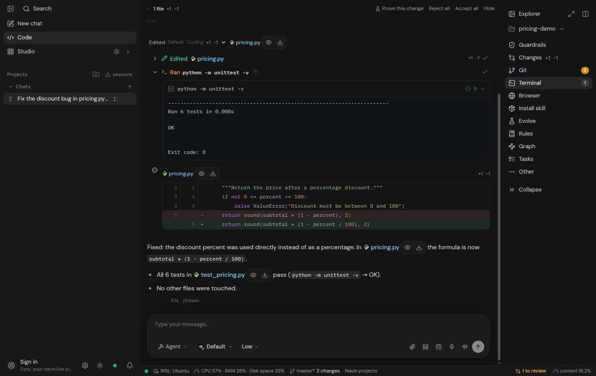
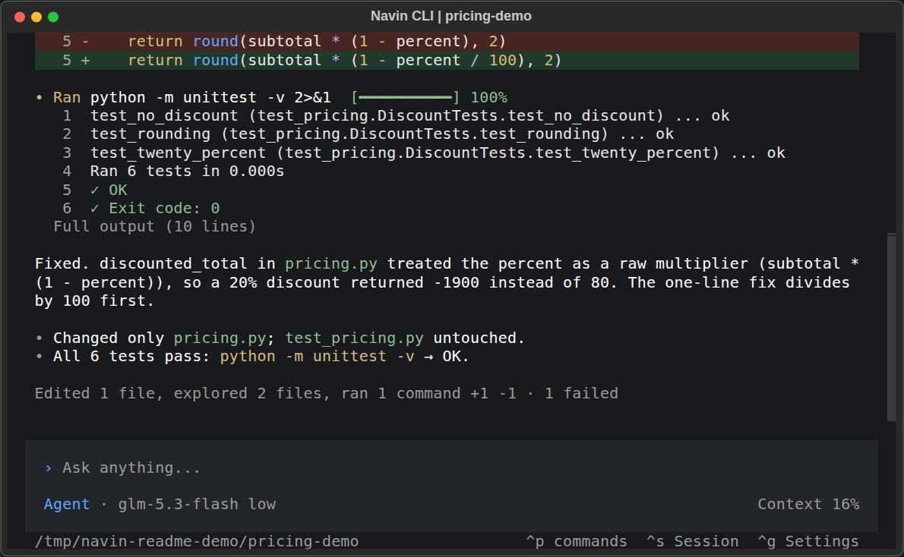

# Navin Desktop and terminal demos

[Back to the README](../README.md) · [Français](../README.fr.md)

The README shows two real sessions on a small, isolated Python project:
one in the Navin Desktop application and one in the terminal. Both use
Navin's agent runtime and a configured model. Playback is shortened, with
pauses to read the request and result.

This page contains still images and a text walkthrough.

## Desktop

The main animation was recorded in the actual Navin Electron application.
The task was submitted through its message composer. The application shows
the project, file changes, agent actions, and test output.



[Download Navin Desktop for Windows, macOS or Linux](https://navin.live/download).

## Terminal

The second animation was recorded from the real Navin CLI and agent runtime.
It shows the same task, including the code diff and test results.



## The request

> Fix the discount bug in pricing.py and run the tests.

## The change

The function treated a percentage as a fraction. For a subtotal of 100,
a 20% discount returned -1900 instead of 80. Navin read the source, edited
the calculation, and ran the existing tests.

```diff
-    return round(subtotal * (1 - percent), 2)
+    return round(subtotal * (1 - percent / 100), 2)
```

## The result

Command:

```bash
python -m unittest -v
```

The six existing tests cover a 20% discount, no discount, a full discount,
rounding, a negative discount, and a discount over 100%. Before the fix,
three tests failed. After the fix, all six passed. The test file was unchanged.

```text
test_discount_over_one_hundred ... ok
test_full_discount ... ok
test_negative_discount ... ok
test_no_discount ... ok
test_rounding ... ok
test_twenty_percent ... ok

Ran 6 tests
OK
Exit code: 0
```

The clips are edited for readability. Execution time depends on the task,
selected model, and environment.

[Try Navin from source](Installation.md#3-build-from-source-gateway--webui).
